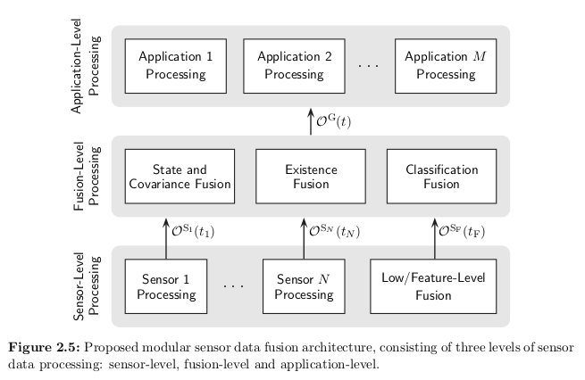

This is a ROS1 workspace to the object fusion algorithm based on Aeberhard (2017) http://dx.doi.org/10.17877/DE290R-18029 https://eldorado.tu-dortmund.de/handle/2003/36011


This work is a simplified implementation of the proposed fusion architecture below.



Install dependencies:

```bash
pip install numpy==1.21.2 rospkg==1.3.0 scipy==1.7.1
```

Compile the workspace

```bash
catkin build
```

Execute the code with:

```bash
rosrun object_fusion fusion.py
```

Visualize the output data (fused object markers) in RVIZ with:

```bash
rosrun object_fusion visualization_fusion.py
``` 

(TO DO:)In case you use this code, please cite it with: 
```
@inproceedings{Poledna2022,
	doi = {10.1109/PlaceHolding},
	url = {},
	year = 2022,
	month = {},
	publisher = {},
	author = {Yuri Poledna and Fabio Reway and Redge Castelino and Maikol Drechsler and Shashank Harthi},
	title = {Placeholding},
	booktitle = {Placeholding for now}
}
```