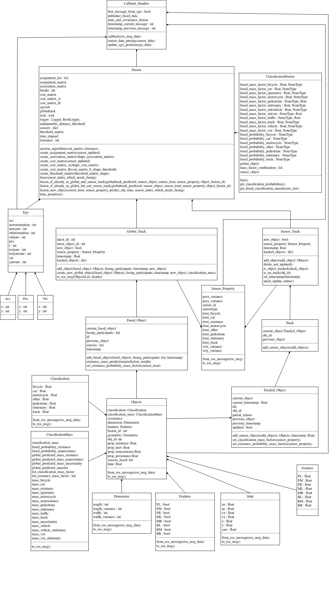

# Object fusion python package!

This package make the fusion by the proposed Aeberhard Algorithm. It is ROS unaware but some classes are ROS integrated, but not kernel classes. 

## Diagrams

An UML like diagram can be seen below:

## Code format

The code is separated in 9 packages
1. [classification_fusion](classification_fusion)
	This package include one class Classification Fusion with 3 methods. The main goal is to make the classification fusion

2. [ego_state](ego_state)
	This package describes the ego states, meaning the movement of the car, or object in which the sensors are installed at. It has 4 struct like classes. Pos (ego position) Acc(ego acceleration) and Vel(ego velocity) and Ego which is a struct that includes Pos Acc and Vel to define ego states attributes.

3. [existence_fusion](existence_fusion)
	package that defines only one function fuse that fuses the existence of each object

4. [log_format](log_format)
	package that holds one class that defines the logging colors and format

5. [object_association](object_association)
	defines functions and 1 struct like class(Features). Features has attributes which are boolean like, using 1 and 0 for defining true and false. the functions calculate the Features and define statistical distances to make object association.

6. [ros2python](ros2python)
	package that includes 7 classes that convert ROS messages with the same name as that class to Python Classes, and if necessary can return a ROS message with the ROS constructor. These are ROS aware objects, if not working with ROS these need to be changed.

7. [state_and_covariance_fusion](state_and_covariance_fusion)
	package with 2 functions that make the cross covariance fusion and the information fusion.

8. [temporal_and_spatial_alignment](temporal_and_spatial_alignment)
	two functions that make temporal and spatial alignment, one of list of objects and other of indicidual objects

9. [track](track)
	This package is perhaps the most important. Here are tracked sensor and global objects, as well as defined what is an object and tracked objects. 5 classes.

And at the root there are:

1. `Fusion.py` which is the main fusion algorithm and deal with objects. ROS unaware object.
2. `Callback_Handler.py` which handle all ROS callbacks, from this must no ROS object be inputed as argument to any other class or method, with the exception of ROS publishers. If not using ROS this is basically useless.

## Authors

Developed by: Yuri Poledna and Fabio Reway and Redge Castelino and Maikol Drechsler and Shashank Harthi
Developed at: Carrisma THI